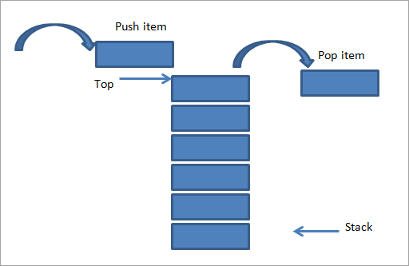
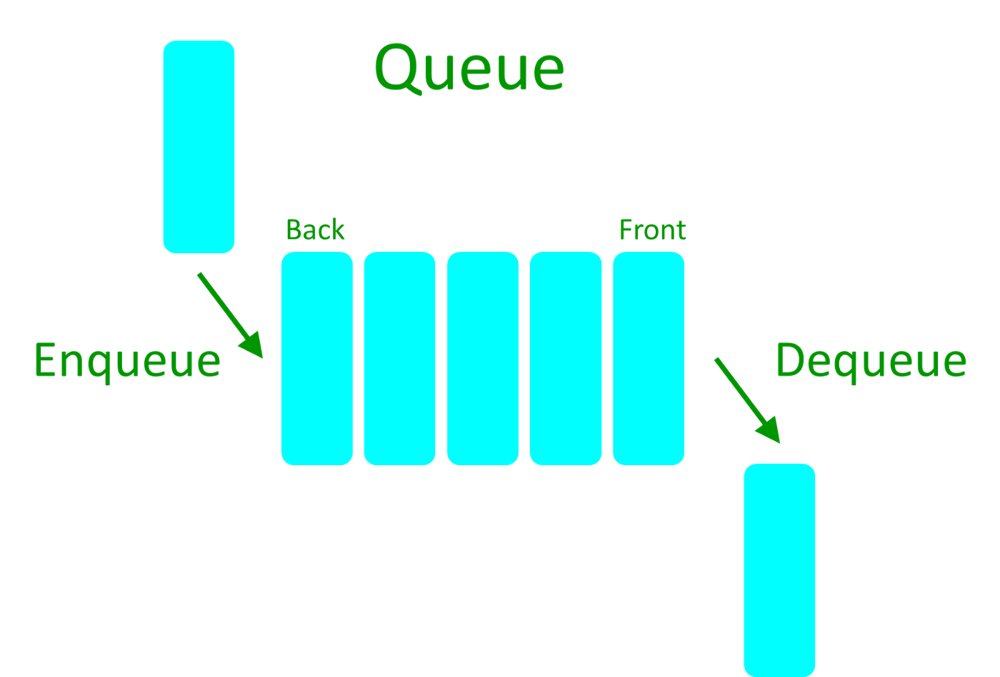

# Estructura de datos

## Estructura de datos lineales

### Pilas

#### Metodos

- constructor
- push
- pop
- getSize
- isEmpty
- print
- clear
- peek

### Colas

#### Metodos

- constructor
- enqueue
- dequeue
- getSize
- isEmpty
- print
- clear
- peek